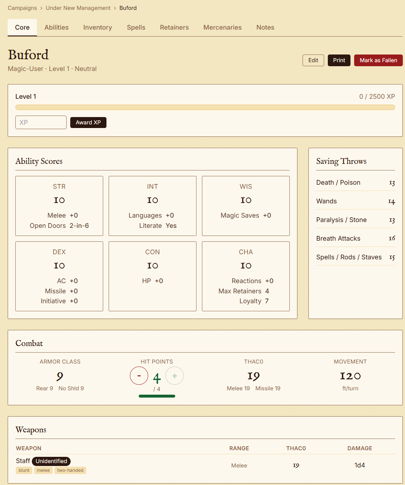

# OSE Sheets

A free, open-source character sheet manager for [Old-School Essentials](https://necroticgnome.com/collections/old-school-essentials) and the broader OSR community.



OSE Sheets is a web application for managing characters, campaigns, and party inventory in OSE games — particularly useful for online play. GMs create campaigns, players join with invite codes, and everyone gets live, interactive character sheets with 3D dice rolling, spell tracking, and automated combat math.

**This is a community project. Free to use, free to host, free to hack on.** If you play OSE or any B/X-derived game, this is for you.

## Features

- **Character sheets** with full OSE stats, saving throws, attribute modifiers, and THAC0
- **Class system** with auto-populated saves, THAC0, and spell slots from class templates
- **3D dice rolling** — click any stat, attack roll, or damage roll to throw dice on screen
- **Spell management** — spellbook, daily memorization, cast/rest cycle with slot tracking
- **Inventory** — equip/unequip weapons and armor, auto-computed AC, ammo tracking with auto-decrement on attack rolls
- **Campaign management** — GM creates a campaign, players join via invite code
- **Permission system** — GMs see everything; players see their own sheets and what the GM reveals
- **Revealable item secrets** — GMs can attach hidden information to items and reveal it piece by piece as players identify things in-game
- **Party stash** — shared loot pool that characters can take from or return to
- **XP and level-up** — GM awards XP, triggers level-ups with automatic stat recalculation
- **Print-friendly** character sheet view
- **Default content** — seeded weapons, armor, equipment, and spells from the OSE rules

## Tech Stack

| Layer | Tech |
|-------|------|
| Frontend | SvelteKit 2, Svelte 5, Tailwind CSS 3 |
| Backend | FastAPI, SQLAlchemy 2, Alembic |
| Database | SQLite (trivially swappable to PostgreSQL) |
| Auth | Google OAuth 2.0, JWT tokens |
| Dice | [dice-box](https://fantasticdice.games/) 3D physics engine |

## Quick Start

### Prerequisites

- Python 3.11+
- Node.js 18+
- A Google Cloud OAuth client (for authentication)

### Setup

```bash
# Clone
git clone https://github.com/morduun/ose-sheet.git
cd ose-sheet

# Install everything
make install

# Set up the database
make migrate

# Seed default content (classes, items, spells)
make seed-all

# Configure OAuth (see backend/.env.example)
cp backend/.env.example backend/.env
# Edit backend/.env with your Google OAuth credentials
```

### Run

```bash
# In one terminal — backend API on :8000
make backend

# In another terminal — frontend on :5173
make frontend
```

Visit http://localhost:5173 to start playing.

### Development Token

For local development without Google OAuth, you can generate a token directly:

```bash
curl -X POST http://localhost:8000/api/auth/token \
  -H "Content-Type: application/json" \
  -d '{"email": "admin@example.com"}'
```

## Make Targets

| Command | Description |
|---------|-------------|
| `make install` | Install backend + frontend dependencies |
| `make backend` | Start the API server with hot reload |
| `make frontend` | Start the frontend dev server |
| `make migrate` | Apply database migrations |
| `make seed-all` | Seed test user, admin, classes, items, and spells |
| `make build` | Production build of the frontend |
| `make db-shell` | Open a SQLite shell to the database |

## Project Structure

```
ose-sheet/
├── backend/
│   ├── app/
│   │   ├── api/            # FastAPI route handlers
│   │   ├── models/         # SQLAlchemy ORM models
│   │   ├── schemas/        # Pydantic request/response schemas
│   │   └── services/       # Business logic (auth, permissions, modifiers)
│   ├── alembic/            # Database migrations
│   ├── seed_data/          # Default classes, items, spells as JSON
│   └── requirements.txt
├── frontend/
│   ├── src/
│   │   ├── lib/
│   │   │   └── components/ # Svelte components (sheet, items, classes, shared)
│   │   └── routes/         # SvelteKit file-based routing
│   └── package.json
├── reference/              # OSE PDFs and screenshots
├── Makefile
└── docs/ROADMAP.md
```

## Contributing

This is an open project under the MIT license. Contributions are welcome — whether that's adding new character classes, fixing bugs, improving the UI, or adding features from the [roadmap](docs/ROADMAP.md).

The default content covers the four core B/X classes (Fighter, Cleric, Magic-User, Thief). Adding the demi-human classes (Dwarf, Elf, Halfling) or OSE Advanced classes (Druid, Illusionist, Paladin, Ranger, etc.) is as simple as adding a JSON file to `backend/seed_data/character_classes/` or creating a new Class using the Referee UI.

## Legal

This project is not affiliated with or endorsed by Necrotic Gnome. Old-School Essentials is a trademark of Necrotic Gnome. Game mechanics are used under the terms of the Open Game License.

## License

[MIT](LICENSE)
